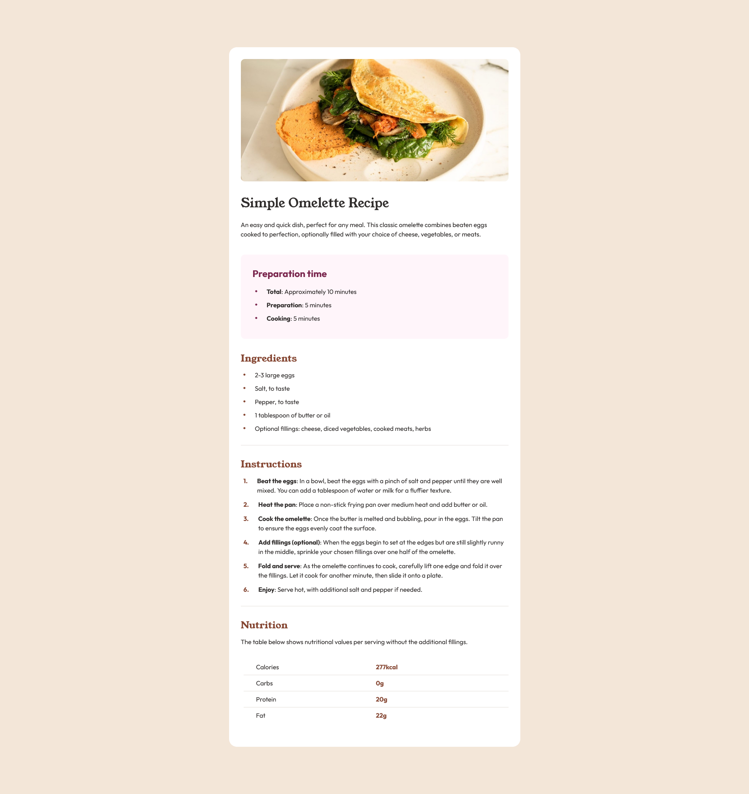

# Frontend Mentor - Recipe page solution

This is a solution to the [Recipe page challenge on Frontend Mentor](https://www.frontendmentor.io/challenges/recipe-page-KiTsR8QQKm). Frontend Mentor challenges help you improve your coding skills by building realistic projects. 

## Table of contents

- [Overview](#overview)
  - [Screenshot](#screenshot)
  - [Links](#links)
- [My process](#my-process)
  - [Built with](#built-with)
  - [What I learned](#what-i-learned)
  - [Useful resources](#useful-resources)
- [Author](#author)

## Overview

### Screenshot



### Links

- Solution URL: [Github repository](https://github.com/laurentGurbala/recipe-page)
- Live Site URL: [GitPage](https://laurentgurbala.github.io/recipe-page)

## My process

### Built with

- Semantic HTML5 markup
- CSS custom properties
- Flexbox
- CSS Grid
- Mobile-first workflow

### What I learned

During this project, I discovered and applied the use of the CSS counter property. This allowed me to automatically number each item in a list with a format such as 1., 2., etc., which was particularly useful for structuring the recipe steps in a clear and scalable way.

With this technique, each new step added to the list is automatically incremented without having to manually adjust the numbers. This approach improves the maintainability of the code, as the order of the steps remains correct even if items are added or removed.

```html
<ul class="recipe__instruction__list">
  <li class="recipe__instruction__step">
    <p>
      <span class="bold">Beat the eggs</span>: In a bowl, beat the eggs with a pinch of salt and pepper
      until they are well mixed.
      You can add a tablespoon of water or milk for a fluffier texture.
    </p>
  </li>
  ...
</ul>
```
```css
.recipe__instruction {
  ...
  counter-reset: step;
}

.recipe__instruction__step::before {
  counter-increment: step;
  content: counter(step)".";
  ...
}
```

### Useful resources

- [counter css](https://developer.mozilla.org/en-US/docs/Web/CSS/counter)

## Author

- Website - [laurent gurbala](https://github.com/laurentGurbala)
- Frontend Mentor - [@laurent gurbala](https://www.frontendmentor.io/profile/laurentGurbala)
- X - [@laurent gurbala](https://x.com/GurbalaLaurent)
